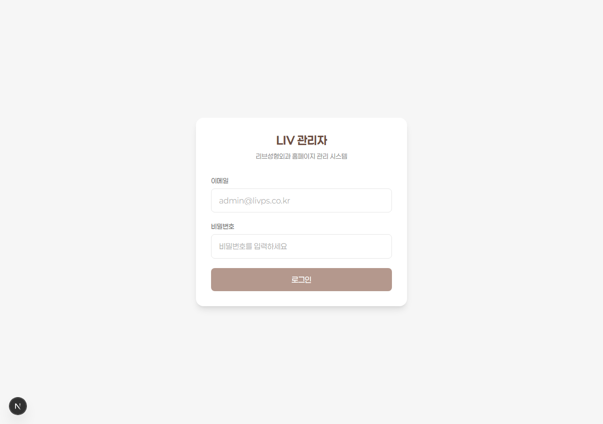
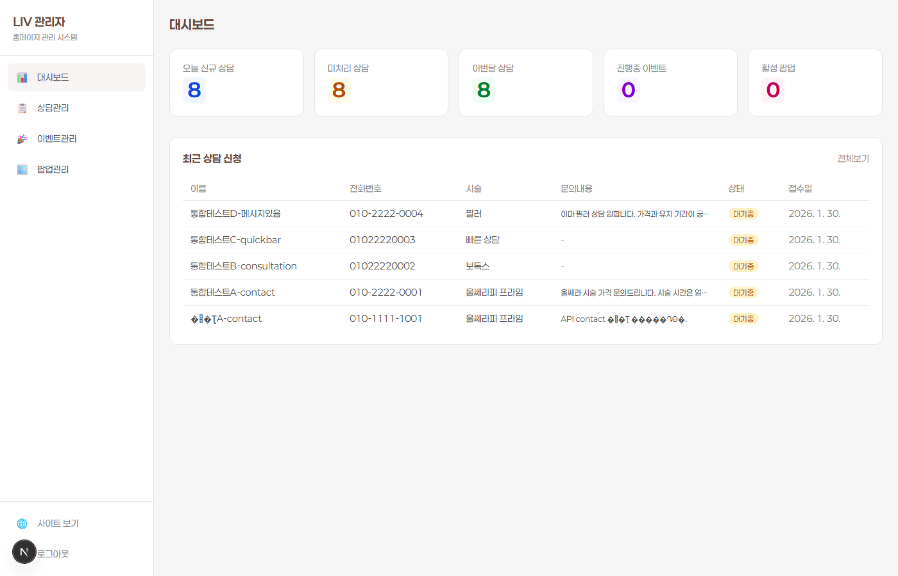
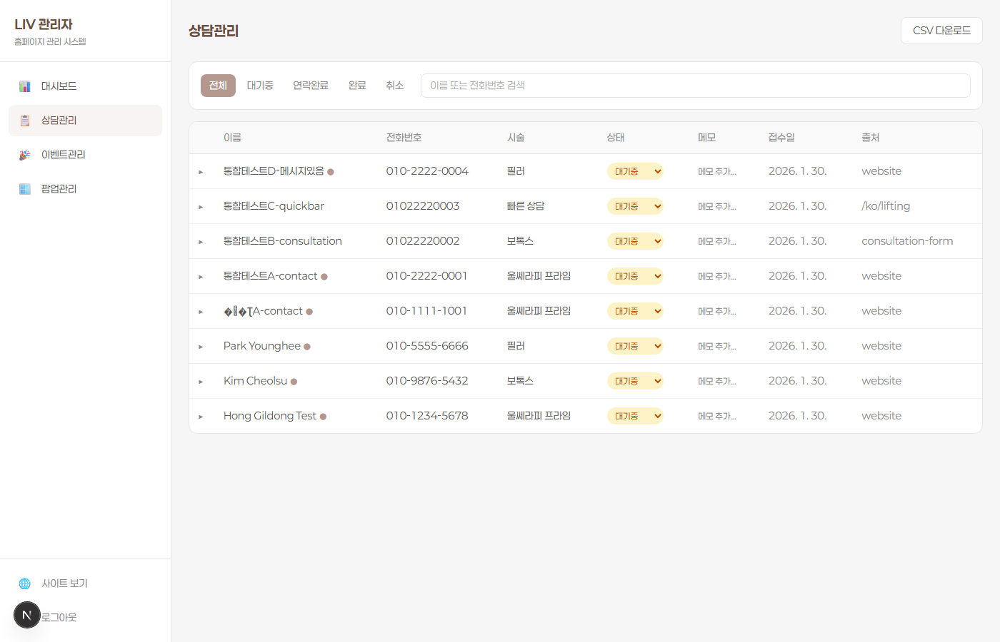
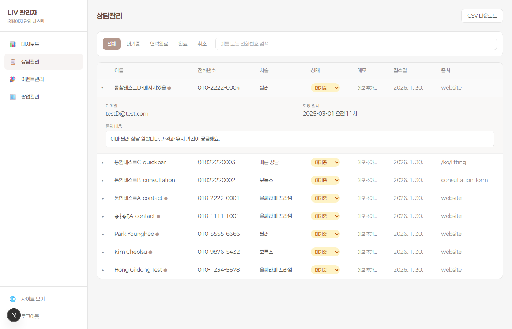
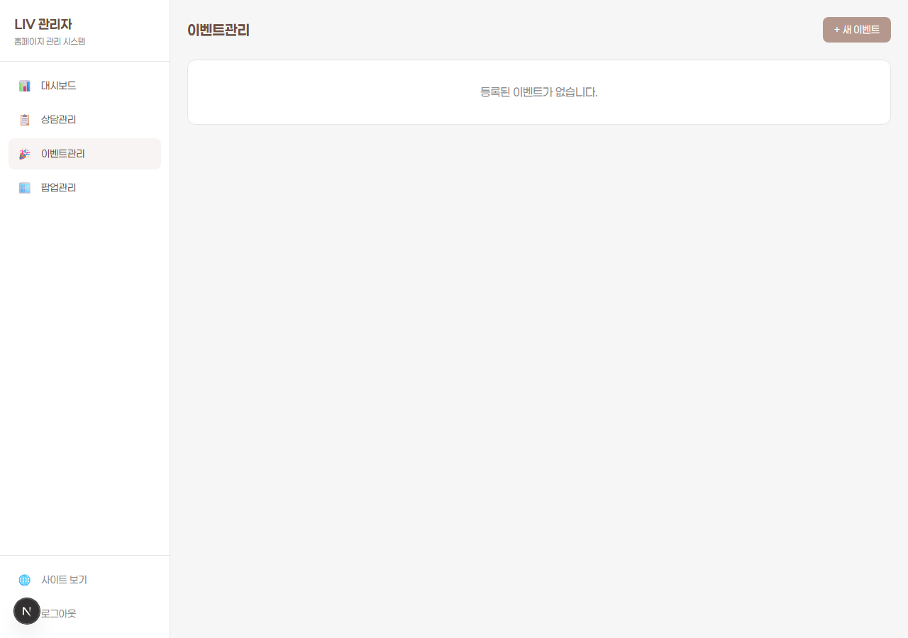
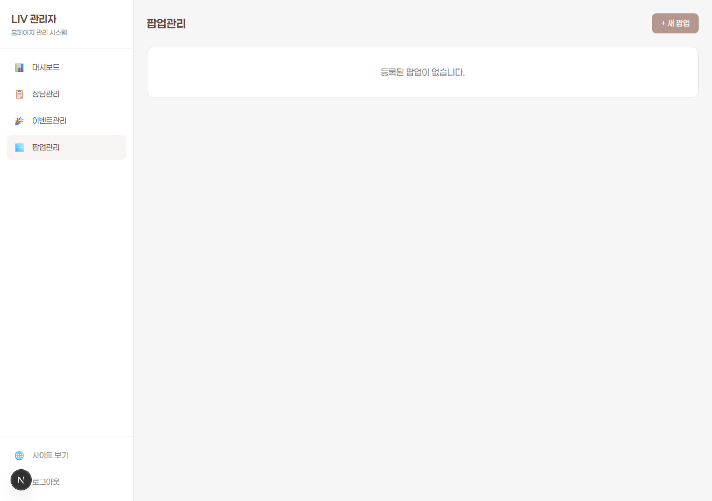

# LIV 성형외과 관리자 시스템 사용설명서

> **문서 버전**: v1.0
> **최종 수정일**: 2026-02-02
> **대상**: LIV 성형외과 전 직원 (실장, 상담사, 간호사, 원장)
> **접속 주소**: https://livps.co.kr/admin

---

## 목차

1. [로그인](#1-로그인)
2. [화면 구성 (사이드바)](#2-화면-구성)
3. [대시보드](#3-대시보드)
4. [상담관리](#4-상담관리)
5. [이벤트관리](#5-이벤트관리)
6. [팝업관리](#6-팝업관리)
7. [운영현황](#7-운영현황)
8. [재고관리](#8-재고관리)
9. [리포트](#9-리포트)
10. [설정](#10-설정)
11. [자주 묻는 질문 (FAQ)](#11-자주-묻는-질문)

---

## 1. 로그인

### 접속 방법

브라우저에서 `https://livps.co.kr/admin` 주소로 접속합니다.



### 로그인 절차

1. **이메일** 입력란에 발급받은 관리자 이메일을 입력합니다
2. **비밀번호** 입력란에 비밀번호를 입력합니다
3. **로그인** 버튼을 클릭합니다

> **참고**: 로그인 계정은 실장님에게 요청하여 발급받으세요.
> 비밀번호를 잊으셨다면 실장님에게 초기화를 요청하세요.

### 로그아웃

왼쪽 사이드바 하단의 **로그아웃** 버튼을 클릭합니다.

---

## 2. 화면 구성

로그인 후 모든 페이지에서 왼쪽에 사이드바 메뉴가 표시됩니다.

### 사이드바 메뉴 구조

| 메뉴 | 설명 | 주요 사용자 |
|------|------|-----------|
| **대시보드** | 오늘의 현황 한눈에 보기 | 전 직원 |
| **상담관리** | 상담 문의 접수/추적/관리 | 실장, 상담사 |
| **이벤트관리** | 홈페이지 이벤트 페이지 등록 | 실장 |
| **팝업관리** | 홈페이지 팝업 알림 등록 | 실장 |
| **운영현황** | 당일 시술/상담 실시간 현황판 | 전 직원 |
| **재고관리** | 주사제/소모품 재고 추적 | 간호사, 실장 |
| **리포트** | 월별 상담/매출 통계 | 원장, 실장 |
| **설정** | 시술 마스터/직원/감사로그 관리 | 실장 |

하단에는 **사이트 보기** (홈페이지로 이동)와 **로그아웃** 버튼이 있습니다.

---

## 3. 대시보드

> **메뉴**: 사이드바 > 대시보드
> **사용 시점**: 출근 후 가장 먼저, 수시로 현황 확인 시

대시보드는 오늘의 병원 운영 현황을 한눈에 보여주는 메인 화면입니다.



### 3.1 상단 지표 카드 (5개)

화면 상단에 5개의 숫자 카드가 표시됩니다.

| 카드 | 의미 | 클릭 시 이동 |
|------|------|-------------|
| **오늘 신규 상담** | 오늘 홈페이지에서 접수된 새 상담 건수 | 상담관리 페이지 |
| **미처리 상담** (또는 오늘 콜백 예정) | 아직 연락하지 않은 상담 건수 | 상담관리 페이지 |
| **이번달 상담** | 이번 달 누적 상담 건수 | 상담관리 페이지 |
| **진행중 이벤트** | 현재 홈페이지에 게시 중인 이벤트 수 | 이벤트관리 페이지 |
| **활성 팝업** | 현재 홈페이지에 표시 중인 팝업 수 | 팝업관리 페이지 |

### 3.2 오늘의 콜백 (콜백 예정 위젯)

오늘 전화해야 할 상담 목록이 시간순으로 표시됩니다.

**표시 정보**: 예정 시간, 환자명, 전화번호, 관심 시술, 담당자

**빠른 처리 버튼**:
- **부재** 버튼 : 전화했으나 안 받았을 때 클릭 → 상태가 "부재중"으로 변경
- **예약확정** 버튼 : 통화 후 예약이 확정되었을 때 클릭 → 상태가 "예약확정"으로 변경

> **주의**: 예정 시간이 지난 콜백은 빨간색 테두리로 강조 표시됩니다. 최우선으로 처리해주세요.

### 3.3 최근 상담 신청 테이블

최근 접수된 상담 5건이 표 형태로 표시됩니다.

**표시 항목**: 이름, 전화번호, 시술, 문의내용 (일부), 상태, 접수일

**전체보기** 링크를 클릭하면 상담관리 페이지로 이동합니다.

### 사용 시나리오: 아침 출근 루틴

1. 관리자 로그인
2. 대시보드에서 **오늘 신규 상담** 확인 → 새 문의가 있으면 상담관리로 이동
3. **오늘 콜백 예정** 확인 → 전화해야 할 건 확인
4. 콜백 위젯에서 순서대로 전화 → **부재** 또는 **예약확정** 처리

---

## 4. 상담관리

> **메뉴**: 사이드바 > 상담관리
> **사용 시점**: 새 상담 접수 시, 고객에게 연락할 때, 상담 진행 상태를 업데이트할 때
> **주요 사용자**: 실장, 상담사

상담관리는 홈페이지를 통해 접수된 모든 상담 문의를 추적하고 관리하는 핵심 기능입니다.



### 4.1 상태 필터 탭

화면 상단에 상태별 필터 탭이 있습니다. 클릭하면 해당 상태의 상담만 표시됩니다.

| 탭 | 의미 | 언제 사용하나 |
|----|------|-------------|
| **전체** | 모든 상담 표시 | 전체 현황 파악 시 |
| **대기중** | 아직 연락하지 않은 새 상담 | 새 문의 처리 시 |
| **연락완료** | 연락이 완료된 상담 | 연락 완료 건 확인 시 |
| **완료** | 예약/방문까지 완료된 건 | 완료 건 확인 시 |
| **취소** | 고객이 취소한 건 | 취소 사유 확인 시 |

> **TIP**: 상태 탭 오른쪽의 검색창에서 **이름** 또는 **전화번호**로 특정 고객을 빠르게 찾을 수 있습니다.

### 4.2 상담 목록 테이블

각 상담은 한 줄로 표시되며, 다음 정보를 보여줍니다.

| 열 | 설명 |
|----|------|
| **이름** | 고객 이름 (이름 옆 점은 메시지가 있다는 표시) |
| **전화번호** | 고객 연락처 |
| **시술** | 관심 시술 (울쎄라, 보톡스, 필러 등) |
| **상태** | 현재 진행 상태 (드롭다운으로 변경 가능) |
| **메모** | 내부 메모 (클릭하여 추가/수정) |
| **접수일** | 상담이 접수된 날짜 |
| **출처** | 상담이 들어온 경로 (website, consultation-form 등) |

### 4.3 상태 변경 방법

상태 열의 **드롭다운**을 클릭하면 바로 상태를 변경할 수 있습니다.

**상태 변경 흐름 (권장)**:

```
[대기중] → 전화함 → [연락완료] → 예약 잡힘 → [완료]
                                    └→ 고객 취소 → [취소]
```

### 4.4 상담 상세 보기 (행 확장)

목록에서 행 왼쪽의 **▶ 화살표**를 클릭하면 상세 정보가 펼쳐집니다.



**펼쳐지는 상세 정보**:

| 항목 | 설명 | 수정 가능 |
|------|------|----------|
| **이메일** | 고객 이메일 주소 | X (읽기 전용) |
| **희망 일시** | 고객이 원하는 방문 날짜/시간 | X (읽기 전용) |
| **문의 내용** | 고객이 작성한 상담 메시지 전문 | X (읽기 전용) |

### 4.5 메모 작성

각 행의 **메모** 영역을 클릭하면 내부 메모를 작성할 수 있습니다.

**메모 활용 예시**:
- "2/3 오전 11시 콜백 약속"
- "필러 가격 문의 - 쥬비덤 볼리프트 관심"
- "전화 3회 부재 - 문자 발송 완료"

### 4.6 CSV 다운로드 (데이터 내보내기)

화면 우측 상단의 **CSV 다운로드** 버튼을 클릭하면 현재 필터링된 상담 데이터를 엑셀 호환 파일로 다운로드합니다.

**포함 항목**: 이름, 전화번호, 이메일, 시술, 상태, 메모, 접수일, 출처

**파일명**: `consultations_2026-02-02.csv` (다운로드 날짜)

> **활용**: 주간 보고, 월별 상담 현황 정리, 외부 시스템 연동 시 사용

### 사용 시나리오: 새 상담 처리

1. 대시보드에서 "오늘 신규 상담: 3" 확인
2. 사이드바 > **상담관리** 클릭
3. **대기중** 탭 클릭 → 새 상담 3건 표시
4. 첫 번째 상담의 ▶ 클릭 → 문의 내용 확인
5. 전화번호 확인 후 고객에게 전화
6. 통화 후 상태를 **연락완료**로 변경
7. 메모에 "2/5 오후 2시 예약 확정" 입력
8. 예약 확정 시 상태를 **완료**로 변경

---

## 5. 이벤트관리

> **메뉴**: 사이드바 > 이벤트관리
> **사용 시점**: 할인 이벤트, 시즌 프로모션, 신규 시술 홍보 페이지를 등록할 때
> **주요 사용자**: 실장

이벤트관리는 홈페이지의 **프로모션 페이지**를 만들고 관리하는 기능입니다.



### 5.1 이벤트란?

이벤트는 홈페이지에 **별도 페이지**로 게시되는 프로모션 콘텐츠입니다.

**예시**:
- "2월 보톡스 20% 할인 이벤트"
- "봄맞이 리프팅 패키지 특가"
- "신규 쥬베룩 시술 런칭 이벤트"

고객이 홈페이지에서 `/promotion` 메뉴를 클릭하면 등록된 이벤트 목록을 볼 수 있고, 각 이벤트를 클릭하면 상세 페이지가 표시됩니다.

### 5.2 이벤트 등록

1. 우측 상단 **+ 새 이벤트** 버튼 클릭
2. 이벤트 작성 폼이 열립니다

**필수 입력 항목**:

| 항목 | 설명 | 예시 |
|------|------|------|
| **URL 슬러그** | 페이지 주소에 사용될 영문 식별자 | `feb-botox-sale` |
| **제목 (한국어)** | 이벤트 제목 (필수) | "2월 보톡스 특가 이벤트" |
| **시작일** | 이벤트 시작 날짜 | 2026-02-01 |
| **종료일** | 이벤트 종료 날짜 | 2026-02-28 |

**선택 입력 항목**:

| 항목 | 설명 |
|------|------|
| **제목 (영어/일본어/중국어)** | 외국어 제목 (다국어 사이트에 표시) |
| **설명 (한/영/일/중)** | 이벤트 상세 내용 |
| **포스터 이미지** | 상세 페이지 메인 이미지 |
| **썸네일 이미지** | 목록에서 보이는 작은 이미지 |
| **갤러리 이미지** | 추가 이미지 여러 장 |
| **카테고리** | lifting / antiaging / laser / skincare / all |
| **관련 시술** | 이벤트와 연관된 시술 페이지 연결 |
| **추천 이벤트** | 체크 시 홈페이지 메인에 노출 |
| **게시 여부** | 체크 해제 시 "임시저장" 상태 |

### 5.3 이벤트 상태

| 상태 | 색상 | 조건 |
|------|------|------|
| **진행중** | 초록색 | 게시 ON + 오늘이 기간 내 |
| **종료** | 회색 | 게시 ON + 종료일 지남 |
| **임시저장** | 노란색 | 게시 OFF (미공개) |

### 5.4 이벤트 수정/삭제

- **수정**: 목록에서 해당 이벤트의 **수정** 버튼 클릭 → 폼에서 내용 수정 후 저장
- **삭제**: **삭제** 버튼 클릭 → 확인 팝업에서 "삭제" 선택

> **주의**: 삭제하면 복구할 수 없습니다. 종료된 이벤트는 삭제보다는 게시 해제(임시저장)를 권장합니다.

### 사용 시나리오: 2월 이벤트 등록

1. 사이드바 > **이벤트관리** > **+ 새 이벤트**
2. 슬러그: `feb-2026-lifting-sale`
3. 제목(한국어): "2월 리프팅 스페셜 가격"
4. 기간: 2026-02-01 ~ 2026-02-28
5. 카테고리: lifting
6. 포스터/썸네일 이미지 업로드
7. 관련 시술: 울쎄라, 써마지 체크
8. 추천 이벤트 체크
9. 게시 체크 → 저장
10. 홈페이지 프로모션 메뉴에서 확인

---

## 6. 팝업관리

> **메뉴**: 사이드바 > 팝업관리
> **사용 시점**: 긴급 공지, 단기 프로모션 알림, 휴진 안내 등을 표시할 때
> **주요 사용자**: 실장

팝업관리는 홈페이지 방문 시 **화면 위에 뜨는 알림창**을 등록하고 관리하는 기능입니다.



### 6.1 팝업이란?

팝업은 홈페이지에 접속하면 **바로 화면 위에 뜨는 이미지 알림**입니다.
고객이 닫기 버튼을 누르면 사라지며, "오늘 하루 안보기" 등의 기능을 제공합니다.

**예시**:
- "설 연휴 휴진 안내"
- "이번 주 한정 보톡스 특가"
- "신규 상담 예약 시 10% 할인"

### 6.2 팝업 vs 이벤트 차이점

| 구분 | 팝업 | 이벤트 |
|------|------|--------|
| **표시 방식** | 화면 위에 뜨는 알림창 | 별도 프로모션 페이지 |
| **콘텐츠** | 이미지 1장 + 클릭 링크 | 다국어 텍스트 + 여러 이미지 |
| **용도** | 짧은 공지, 긴급 알림 | 상세한 프로모션 소개 |
| **기간 단위** | 날짜+시간 (세밀 제어) | 날짜 단위 |

> **언제 뭘 쓰나?**
> - 짧은 공지/알림 → **팝업** (예: "내일 휴진", "오늘만 특가")
> - 상세 프로모션 → **이벤트** (예: "2월 리프팅 할인", "신규 시술 안내")
> - 둘 다 사용 가능 → 팝업으로 "이벤트 진행중!" 알리고, 클릭하면 이벤트 페이지로 이동

### 6.3 팝업 등록

1. 우측 상단 **+ 새 팝업** 버튼 클릭
2. 팝업 작성 폼이 열립니다

**입력 항목**:

| 항목 | 설명 | 예시 |
|------|------|------|
| **제목** | 관리용 이름 (고객에게 안 보임) | "2월 설 연휴 안내" |
| **이미지** | 팝업에 표시될 이미지 업로드 | (디자인된 이미지 파일) |
| **링크 URL** | 이미지 클릭 시 이동할 주소 | `/ko/promotion` |
| **링크 대상** | 현재 창 / 새 창 | 현재 창 |
| **표시 시작** | 팝업이 뜨기 시작하는 날짜/시간 | 2026-02-01 09:00 |
| **표시 종료** | 팝업이 사라지는 날짜/시간 | 2026-02-10 23:59 |
| **너비** | 팝업 이미지 너비 (px) | 480 (기본값) |
| **순서** | 여러 팝업 시 표시 우선순위 | 1 |
| **활성화** | 즉시 표시 여부 | 체크 |
| **모바일 표시** | 모바일에서도 표시할지 여부 | 체크 |

### 6.4 팝업 상태

| 상태 | 색상 | 조건 |
|------|------|------|
| **활성** | 초록색 | 활성 ON + 현재 시간이 표시 기간 내 |
| **예정** | 파란색 | 활성 ON + 아직 시작 전 |
| **종료** | 회색 | 활성 ON + 종료 시간 지남 |
| **비활성** | 빨간색 | 활성 OFF (수동 중지) |

### 6.5 팝업 활성/비활성 전환

목록에서 **활성/비활성 토글 버튼**을 클릭하면 즉시 전환됩니다.
긴급하게 팝업을 내려야 할 때 유용합니다.

### 사용 시나리오: 설 연휴 휴진 안내

1. 사이드바 > **팝업관리** > **+ 새 팝업**
2. 제목: "2026 설 연휴 휴진 안내"
3. 미리 제작한 휴진 안내 이미지 업로드
4. 링크 URL: (비워두거나 `/ko/contact` 입력)
5. 표시 시작: 2026-01-25 09:00
6. 표시 종료: 2026-01-30 23:59
7. 모바일 표시: 체크
8. 활성화: 체크 → 저장
9. 연휴가 끝나면 자동으로 종료됨 (수동 비활성도 가능)

---

## 7. 운영현황

> **메뉴**: 사이드바 > 운영현황
> **사용 시점**: 당일 시술/상담 진행 상황을 실시간으로 파악할 때
> **주요 사용자**: 전 직원

운영현황은 병원 내 실시간 **시술/상담 현황판**입니다. 어떤 환자가 어느 방에서 무슨 시술을 받고 있는지 한눈에 파악할 수 있습니다.

### 7.1 케이스 유형

| 아이콘 | 유형 | 기본 소요시간 |
|--------|------|-------------|
| 상담 | CONSULT (상담) | 20분 |
| 스킨케어 | SKINCARE (피부관리) | 40분 |
| 마취 | ANESTHESIA (마취) | 30분 |
| 시술 | PROCEDURE (시술) | 60분 |

### 7.2 케이스 상태

| 상태 | 의미 |
|------|------|
| **대기** | 환자가 대기 중 |
| **진행 중** | 현재 시술/상담 진행 중 |
| **완료** | 시술/상담 완료 |
| **취소** | 취소됨 |

### 7.3 케이스 등록

1. **케이스 추가** 버튼 클릭
2. 환자명, 전화번호 입력
3. 시술 유형 선택 (상담/스킨케어/마취/시술)
4. 담당 원장 선택 (천원장 / 김원장)
5. 시술 종류 선택 (보톡스, 울쎄라 등)
6. 방 배정
7. 저장

### 7.4 진행 관리

- 카드 형태로 각 케이스가 표시됩니다
- 경과 시간이 실시간으로 표시됩니다
- 예상 시간을 초과하면 **경고 표시** (노란색→빨간색)가 나타납니다
- 상태를 클릭하여 변경할 수 있습니다 (대기 → 진행 중 → 완료)

### 7.5 방(Room) 구성

| 방 번호 | 유형 |
|---------|------|
| cons-1, cons-2 | 상담실 |
| mgmt-5 ~ mgmt-9 | 관리실 |
| proc-1, proc-2 | 시술실 |

### 사용 시나리오: 오늘 스케줄 관리

1. 아침 출근 → **운영현황** 접속
2. 오늘 예약된 환자별로 케이스 추가
3. 환자 도착 시 상태를 "대기" → "진행 중"으로 변경
4. 시술 완료 시 "완료"로 변경
5. 장시간 경과된 케이스에 경고가 뜨면 확인

---

## 8. 재고관리

> **메뉴**: 사이드바 > 재고관리
> **사용 시점**: 시술 전후 재고 차감, 입고 처리, 재고 부족 확인 시
> **주요 사용자**: 간호사, 실장

### 8.1 재고 카테고리

| 카테고리 | 포함 품목 예시 |
|---------|--------------|
| **장비 팁/카트리지** | 울쎄라 팁(4.5mm, 3.0mm, 1.5mm), 써마지 팁(600, 900), 덴서티 팁 |
| **주사제** | 보톡스(제오민, 앨러간), 필러(쥬비덤, 레스틸렌, 벨로테로), 스킨부스터(리쥬란, 쥬베룩, 스컬트라) |
| **실리프팅** | 실루엣소프트, 민트실, 네오닥터, 압토스 |
| **소모품** | 주사 바늘, 캐뉼라, 시린지, 수액, 마취제, 거즈, 소독제, 장갑, 드레싱 |
| **약물/연고** | 프로포폴, 미다졸람(냉장), 에펙신, 타라비드 |
| **스킨케어 제품** | 관리 시 사용하는 제품류 |

### 8.2 재고 상태 표시

| 상태 | 조건 | 표시 |
|------|------|------|
| **정상** | 현재고 > 최소수량 | 초록색 |
| **부족** | 현재고 <= 최소수량 | 노란색 (주문 필요) |
| **품절** | 현재고 = 0 | 빨간색 (긴급 주문) |

### 8.3 재고 사용 기록

시술 후 사용한 재고를 기록합니다.

**기록 유형**:

| 유형 | 용도 | 예시 |
|------|------|------|
| **사용** | 시술에 사용 | "리쥬란 힐러 1개 사용 - 환자: 김수정" |
| **입고** | 새 물품 입고 | "쥬비덤 볼리프트 10개 입고" |
| **조정** | 실사 후 수량 보정 | "재고 실사 결과 -2 조정" |
| **폐기** | 유효기간 만료 등 | "제오민 2바이알 폐기 (유효기간 초과)" |

### 8.4 시술별 필요 물품 (레시피)

자주 하는 시술에 필요한 물품 목록이 미리 등록되어 있습니다.

**예시 - 리쥬란 HB 시술**:
- 리쥬란 HB 1개
- 30G 바늘 1개
- 1cc 시린지 1개
- 거즈 2개

> **보관 주의사항**: "냉장보관" 표시가 있는 품목은 반드시 냉장 상태를 유지해야 합니다.
> 특히 보톡스, 실루엣소프트, 마취제(프로포폴, 미다졸람, 케타민)는 냉장 필수입니다.

### 사용 시나리오: 시술 후 재고 차감

1. 환자에게 리쥬란 힐러 시술 완료
2. **재고관리** > 리쥬란 힐러 항목 찾기
3. **사용** 기록 추가: 수량 1, 환자명, 차트번호 입력
4. 저장 → 재고 자동 차감
5. 재고가 최소수량 이하이면 부족 알림 표시 → 발주 진행

---

## 9. 리포트

> **메뉴**: 사이드바 > 리포트
> **사용 시점**: 월말 결산, 실적 확인, 경영 분석 시
> **주요 사용자**: 원장, 실장

### 9.1 조회 조건

상단에서 **년도**와 **월**을 선택하여 조회합니다.

### 9.2 핵심 지표 (4개 카드)

| 지표 | 의미 | 예시 |
|------|------|------|
| **총 매출** | 해당 월 총 매출액 | 3.7억 |
| **총 시술 건수** | 해당 월 시술 횟수 | 250건 |
| **건당 평균 매출** | 시술 1건당 평균 금액 | 148만원 |
| **목표 달성률** | 월 목표 대비 달성 비율 | 148% |

### 9.3 상담 퍼널 (Funnel)

상담 접수부터 완료까지의 전환율을 보여줍니다.

```
전체 상담 (184건)
  └→ 연락 완료 (156건, 84.8%)
       └→ 예약 확정 (98건, 53.3%)
            └→ 방문 완료 (82건, 44.6%)
                 └→ 노쇼 (16건, 8.7%)
```

### 9.4 인기 시술 TOP 10

시술별 건수와 매출을 순위로 보여줍니다.

### 9.5 원장별 실적

| 원장 | 상담 건수 | 시술 건수 | 매출 | 전환율 |
|------|----------|----------|------|--------|
| 천원장 | 98 | 142 | 1.48억 | 48.2% |
| 김원장 | 86 | 108 | 8,765만 | 41.5% |

### 9.6 일별 추이 차트

해당 월의 일별 상담 건수 및 시술 건수를 차트로 보여줍니다.

---

## 10. 설정

> **메뉴**: 사이드바 > 설정
> **사용 시점**: 시술 정보 수정, 직원 관리, 시스템 이력 확인 시
> **주요 사용자**: 실장

설정 페이지는 3개의 탭으로 구성됩니다.

### 10.1 시술 마스터

병원에서 제공하는 시술 목록을 관리합니다.

**관리 항목**: 시술명, 카테고리, 가격 범위, 소요시간, 활성화 여부

**예시**:

| 시술명 | 카테고리 | 가격 범위 | 소요시간 | 활성 |
|--------|---------|----------|---------|------|
| 울쎄라 | lifting | 150~300만원 | 60분 | O |
| 써마지 FLX | lifting | 80~200만원 | 45분 | O |
| 보톡스 | antiaging | 10~50만원 | 15분 | O |
| 제모 레이저 | laser | 5~20만원 | 15분 | X (비활성) |

> **비활성 시술**: 더 이상 제공하지 않는 시술은 삭제하지 말고 **비활성** 처리하세요. 과거 데이터 연동에 필요합니다.

### 10.2 직원 관리

직원 정보를 관리합니다.

| 이름 | 역할 | 직책 | 상태 |
|------|------|------|------|
| 천OO | 대표원장 | 성형외과 전문의 | 활성 |
| 김OO | 원장 | 피부과 전문의 | 활성 |
| 박서현 | 실장 | - | 활성 |
| 이수진 | 상담사 | - | 활성 |
| 최민지 | 상담사 | - | 활성 |

### 10.3 감사 로그

관리자 시스템에서 수행된 모든 작업 이력을 시간순으로 기록합니다.

**기록되는 활동**:

| 아이콘 | 활동 | 예시 |
|--------|------|------|
| 생성 | 새 데이터 생성 | "신규 상담 접수 (홍길동)" |
| 수정 | 기존 데이터 수정 | "상태 변경: 신규 → 콜백 예정" |
| 삭제 | 데이터 삭제 | "이벤트 #12 삭제" |
| 로그인 | 관리자 로그인 | "IP: 211.xxx.xxx.xxx" |
| 내보내기 | 데이터 다운로드 | "CSV 내보내기 (142건)" |

> **활용**: 누가 언제 무엇을 변경했는지 추적할 때 사용합니다.
> 문제 발생 시 감사 로그를 확인하여 원인을 파악합니다.

---

## 11. 자주 묻는 질문

### Q1. 상담 문의는 어디서 들어오나요?
홈페이지의 **상담 예약** 페이지(`/contact`)에서 고객이 폼을 작성하면 자동으로 관리자 시스템에 등록됩니다. 각 시술 페이지의 빠른 상담 바, 플로팅 상담 버튼에서도 접수됩니다.

### Q2. 팝업은 동시에 여러 개 표시할 수 있나요?
네. **순서** 번호가 낮은 팝업부터 표시됩니다. 단, 너무 많으면 고객 경험에 좋지 않으니 2개 이하를 권장합니다.

### Q3. 이벤트를 삭제하면 URL은 어떻게 되나요?
이벤트가 삭제되면 해당 페이지는 404(찾을 수 없음)가 됩니다. 이미 외부에 URL을 공유한 경우 삭제보다 **게시 해제**(임시저장)를 권장합니다.

### Q4. CSV 파일이 엑셀에서 한글이 깨져요
관리자 시스템에서 다운로드하는 CSV는 UTF-8 BOM 인코딩을 사용하므로 엑셀에서 정상적으로 열립니다. 그래도 깨지면 엑셀에서 **데이터 > 텍스트/CSV 가져오기**를 사용하여 UTF-8로 열어주세요.

### Q5. 비밀번호를 잊어버렸어요
실장님에게 비밀번호 초기화를 요청하세요. 보안을 위해 초기화 후 반드시 새 비밀번호로 변경해주세요.

### Q6. 재고에서 "냉장보관" 표시는 어떤 품목인가요?
보톡스(제오민, 앨러간 등), 실루엣소프트, 마취제(프로포폴, 미다졸람, 케타민)가 해당됩니다. 이 품목은 반드시 냉장고에 보관해야 하며, 상온 노출 시 폐기해야 합니다.

### Q7. 모바일에서도 관리자 시스템을 사용할 수 있나요?
네, 반응형으로 설계되어 휴대폰 브라우저에서도 접속 가능합니다. 다만 테이블이 많은 상담관리 등은 PC에서 사용하는 것이 편리합니다.

---

## 부록: 역할별 주요 사용 기능

### 실장

| 업무 | 기능 | 빈도 |
|------|------|------|
| 상담 문의 확인/배정 | 대시보드 → 상담관리 | 매일 |
| 이벤트 등록/관리 | 이벤트관리 | 수시 |
| 팝업 등록/관리 | 팝업관리 | 수시 |
| 주간/월간 보고서 작성 | 리포트 + CSV 다운로드 | 주1회/월1회 |
| 직원/시술 관리 | 설정 | 수시 |

### 상담사

| 업무 | 기능 | 빈도 |
|------|------|------|
| 오늘 할 일 확인 | 대시보드 (콜백 위젯) | 매일 출근 시 |
| 신규 상담 전화 | 상담관리 (대기중 탭) | 매일 |
| 상담 상태 업데이트 | 상담관리 (상태 변경) | 매일 |
| 메모 기록 | 상담관리 (메모) | 매일 |

### 간호사

| 업무 | 기능 | 빈도 |
|------|------|------|
| 시술 현황 확인 | 운영현황 | 매일 |
| 재고 사용 기록 | 재고관리 (사용 등록) | 시술 후 매번 |
| 재고 부족 확인 | 재고관리 (부족 알림) | 매일 |
| 입고 처리 | 재고관리 (입고 등록) | 물품 도착 시 |

### 원장

| 업무 | 기능 | 빈도 |
|------|------|------|
| 전체 현황 파악 | 대시보드 | 매일 |
| 월별 실적 확인 | 리포트 | 월1회 |
| 시술 운영 확인 | 운영현황 | 수시 |

---

> **문의**: 시스템 사용 중 문제가 발생하면 실장님에게 연락해주세요.
